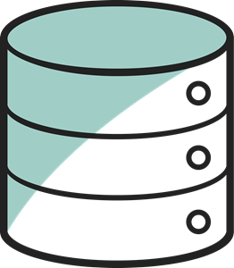
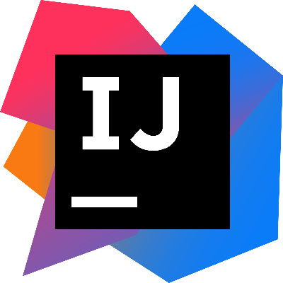

<h1 align="center">Hi there, I'm <a href="/web/index.htm">Alexander</a> 
</h1>
<h3 align="center">👨‍💻About me</h3>

I am a novice Backend developer. 
My journey started with learning python,
but after three months of training, 
I realized that this was not enough 
and started learning HTML, Java, SQL, Kotlin 
and I'm not going to stop. In the future 
I'm going to become a Fullstack developer.
At the moment I am still studying, 
but I am ready to participate in interesting 
projects!

<em>How to contact me: </em>

<h3 align="center">💻Programming languages</h3>

<h3 align="center">🌐Web development</h3>

<h3 align="center">🔨Tools</h3>

<h3 align="center">🎓Сourses</h3>
<table>
<tr><th>Platform</th><th>Training course</th><th>Programming language</th><th>Certificate or diploma</th></tr>
<tr><td>Mimo</td><td><a href="https://mimo.org/web/194/section/0">HTML</a></td><td>HTML</td><td><a href="https://disk.yandex.ru/i/gyYKdQh8GW0iUg">Certificate</a></td></tr>
<tr><td>Mimo</td><td><a href="https://mimo.org/web/50/section/32">SQL</a></td><td>SQLite</td><td><a href="https://disk.yandex.ru/i/Q9bQKsjdnMllzg">Certificate</a></td></tr>
</table>

<h3 align="center">⚙️GitHub statistics</h3>

<h3>📚Codewars:</h3>

<em>
<strong>P.S</strong> If you have any suggestions, feel free to write to me
</em>

